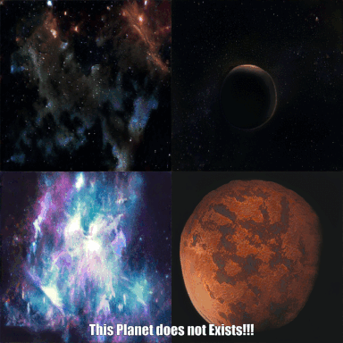

# planetGenerator

### Three steps to Build a PLANET with GAN
1. Build a spider to crawl into World Wide Web and collect images of exoplanets
2. Train FastGAN to learn planets distribution and Wait till GAN attains John nash equilibrium
3. Generate New Planets

* It even generate shadow of the planet opposite to star
* But most of the planets are irregular shapes
* Share your taught on irregular shapes or how to fix it

### Click gif to use colab 

